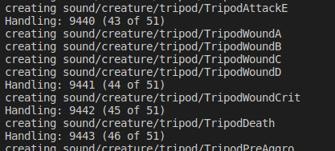

Python version of https://github.com/mattibalize-lab/MuteSounds

See that repo for install instructions

Each line of sounds.txt is the sound id from https://db.ascension.gg/?sounds with the comma `,` and everything after it as optional/ignored

This implementation uses a local file for lookups instead of querying wow.tools

