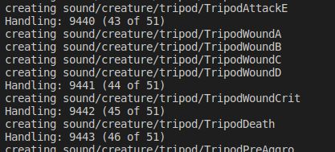

Python version of https://github.com/mattibalize-lab/MuteSounds

See that repo for install instructions.  The created `sound` folder should go in your `Ascension Launcher/resources/client/Data/enUS/` directory.

Each line of sounds.txt is the sound id from https://db.ascension.gg/?sounds with the comma `,` and everything after it as optional/ignored

This implementation uses a local file for lookups instead of querying wow.tools

## Important
Current version  of the launcher will attempt to delete `sounds` folder every time you patch but will fail and sit there.  You need to delete the `sounds` folder before starting to patch then restore it after the `verify` step finishes.  Or launch the game exe directly